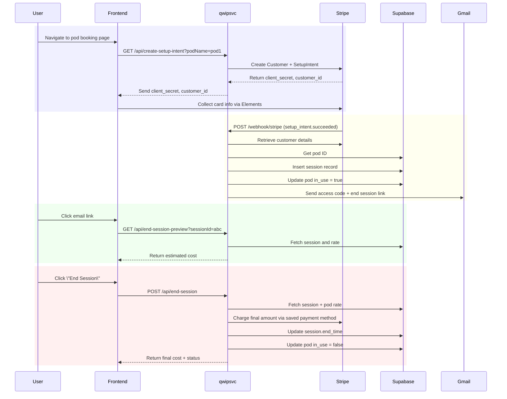

# QWIPSVC — FastAPI Microservice responsible for Pod Bookings and Payments

This service handles real-time booking, metered billing, and email-based access control for Qwip pods.

---

## Architecture 




---

## Project Structure
```
qwipsvc/
├── svc/
│   └── main.py                            ← FastAPI backend
|   └── database_accessor.py               ← Supabase Accessors
|   └── email_manager.py                   ← Email Manager
|   └── env.py                             ← Environment Variable Store
|   └── models.py                          ← Pydantic Models
|   └── payments_manager.py                ← Stripe Handler
|   └── seam_accessor.py                   ← Seam Accessor for Access Code Generation (Not Implemented)
|   └── types.py                           ← Custom Types
|   └── utils.py                           ← Util Functions
├── tests/
│   └── unit                    
│       └── conftest.py                    ← Pytest Fixtures
│       └── test_email_manager.py         
│       └── test_payments_manager.py 
│       └── test_utils.py      
├── requirements.txt                       ← Dependencies
├── .env.example                           ← Sample environment config
├── .gitignore                             ← Ignore sensitive files
└── Makefile                               ← For local dev commands
```

---

## Create & Activate Python Environment
```bash
python3 -m venv venv
source venv/bin/activate
```

---

## Install Dependencies
```bash
pip install -r requirements.txt
```

---

## Configure Environment Variables
```bash
make env
```
Fill in your values:
```
STRIPE_SECRET=sk_test_...
STRIPE_WEBHOOK_SECRET=whsec_...
SUPABASE_URL=https://your-project.supabase.co
SUPABASE_KEY=your-secret-key
EMAIL_PASSWORD=your-gmail-app-password
```

---

## Start Server Locally
```bash
make service
```
Test on: `http://localhost:8000/api/create-payment-intent?podName=test`

---

## Run Unit + Integration Tests
```bash
make test
```

> :warning: Some tests are skipped unless you have a live Supabase session ID or Stripe setup.


---

## Code Formatting & Linting
```bash
make format
```

---

## Deployment
1. Push this code to a new GitHub repo named `qwipsvc`
2. Go to [railway.app](https://railway.app)
3. Click **New Project → Deploy from GitHub → Select `qwipsvc`**
4. Add environment variables via Railway dashboard
5. Done ✅

### Procfile
```
web: uvicorn svc.main:app --host 0.0.0.0 --port $$PORT
```

---

## ✅ STEP 9: (Optional) Stripe Webhook Forwarding (for local dev)
```bash
stripe listen --forward-to localhost:8000/webhook/stripe
```
