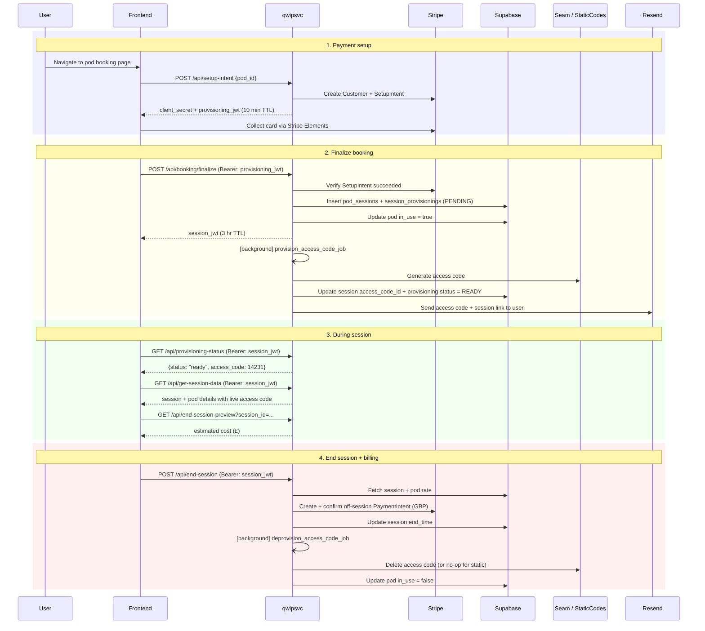

# qwipsvc — FastAPI Backend for Qwip Pod Bookings

qwipsvc is the backend service powering [Qwip](https://qwip.co.uk), a metered-usage platform for bookable quiet pods around London. It handles the full session lifecycle: payment setup, smart lock access code provisioning, live cost calculation, and metered billing at checkout.

**Stack:** Python 3.12 · FastAPI · Supabase (PostgreSQL) · Stripe · Seam · Resend

---

## How it works

Sessions are pay-as-you-go. Users enter their card details before entering a pod; billing happens at the end based on actual time used. Access codes for the pod door locks are provisioned dynamically via the Seam API (or from a static pre-defined list for popup/event deployments).

### Booking flow (current JWT-based)



---

## Project structure

```
qwipsvc/
├── svc/
│   ├── main.py                   ← FastAPI app, all route handlers
│   ├── database_accessor.py      ← Supabase read/write helpers
│   ├── payments_manager.py       ← Stripe client, SetupIntent creation, off-session charging
│   ├── provisioning_manager.py   ← Background jobs: provision/deprovision access codes
│   ├── jwt_manager.py            ← JWT creation + verification (PROVISIONING / SESSION scopes)
│   ├── static_code_manager.py    ← AES-GCM encrypted static door codes (popup/MVP mode)
│   ├── seam_accessor.py          ← Seam API: set/get/delete time-bound access codes on locks
│   ├── email_manager.py          ← Resend transactional email (access email, payment alerts)
│   ├── models.py                 ← Pydantic request/response models
│   ├── custom_types.py           ← Enums: TokenScope, ProvisionStatus
│   ├── env.py                    ← Environment variable loading
│   └── utils.py                  ← Session cost calculation, datetime formatting
├── tests/
│   └── unit/
│       ├── conftest.py
│       ├── test_payments_manager.py
│       └── test_utils.py
├── Procfile                      ← Railway deployment config
├── requirements.txt
├── Makefile
└── .env.example
```

---

## API reference

### Active endpoints

| Method | Path | Auth | Description |
|--------|------|------|-------------|
| `POST` | `/api/setup-intent` | None | Creates a Stripe Customer + SetupIntent. Returns `client_secret` for Stripe Elements and a short-lived `provisioning_jwt` (10 min). |
| `GET` | `/api/pod` | None | Returns pod metadata: name, address, price/min, in_use status. |
| `POST` | `/api/booking/finalize` | `provisioning_jwt` | Verifies SetupIntent succeeded, creates session + provisioning records, marks pod in_use, kicks off access code provisioning in background. Returns `session_jwt` (3 hr). Idempotent — safe to retry. |
| `GET` | `/api/provisioning-status` | `session_jwt` | Poll for access code readiness. Returns `{status: "pending"\|"ready"\|"failed", access_code: int\|null}`. |
| `GET` | `/api/get-session-data` | `session_jwt` | Returns full session and pod details including the live access code. |
| `GET` | `/api/end-session-preview` | None (session_id param) | Returns current session cost estimate without ending the session. |
| `GET` | `/api/is-session-complete` | None (session_id param) | Returns whether a session has been ended. |
| `GET` | `/api/lock-status` | None | Returns Seam lock state for a device. Always returns `locked=true` in static code mode. |
| `POST` | `/api/end-session` | `session_jwt` | Calculates final cost, charges user via off-session Stripe PaymentIntent, closes session in DB, triggers access code deprovisioning in background. |
| `POST` | `/webhook/stripe` | Stripe signature | Validates and processes inbound Stripe webhook events. |

> **Deprecated:** `GET /api/create-setup-intent` and `POST /api/confirm-booking` are from an older flow that didn't use JWTs. They remain in the codebase but should not be used.

### JWT token scopes

Two token types are used to scope what a token can be used for:

- **`PROVISIONING`** (10 min TTL) — issued at setup-intent creation, consumed once at `/api/booking/finalize`
- **`SESSION`** (3 hr TTL) — issued at finalize, used for provisioning status checks, session data, and ending the session

Tokens carry their scope name as a top-level key in the payload. `verify_jwt_token` enforces the expected scope before returning the inner payload.

---

## Access code modes

The `USE_STATIC_CODES` env flag switches between two modes:

| Mode | When to use | How it works |
|------|-------------|--------------|
| **Dynamic (Seam)** | Production with real smart locks | Calls the Seam API to create a time-bound code (3 hr window) on the physical lock. Polls until status = `set`. Deleted on session end. |
| **Static** | Popups, events, MVP without live locks | Picks a random code from a hardcoded list, encrypts it with AES-GCM, and stores the ciphertext as `access_code_id`. Decrypted on read. No deprovisioning needed. |

---

## Billing

- Currency: GBP
- Rate: per-minute, defined per pod in the `pods` table (`price` field)
- Billing is **post-pay** — the Stripe PaymentIntent is created and confirmed at session end
- Minimum charge: 30p (to cover Stripe fees). Sessions below this threshold are not billed
- **Promo mode** (`PROMO_MODE=true`): deducts 10 minutes from billable time (first 10 min free)
- Failed charges are logged to the `invalid_payment_attempts` table and trigger an alert email to founders

---

## Supabase schema (inferred)

| Table | Key columns |
|-------|-------------|
| `pods` | `id`, `name`, `address`, `price` (per min), `in_use` |
| `pod_sessions` | `id`, `pod_id`, `user_email`, `start_time`, `end_time`, `stripe_customer_id`, `stripe_payment_method`, `access_code_id`, `stripe_setup_intent_id` |
| `session_provisionings` | `id`, `session_id`, `status` (pending/ready/failed), `attempts`, `created_at`, `updated_at`, `ready_at`, `failed_at` |
| `invalid_payment_attempts` | `session_id`, `session_cost` |

---

## Environment variables

```bash
# Stripe
STRIPE_SECRET=sk_live_...
STRIPE_WEBHOOK_SECRET=whsec_...

# Supabase
SUPABASE_URL=https://your-project.supabase.co
SUPABASE_KEY=your-service-role-key

# Email (Resend)
RESEND_API_KEY=re_...

# JWT
JWT_SECRET_KEY=your-random-secret

# Seam (smart locks)
SEAM_API_KEY=seam_...

# Access code mode
USE_STATIC_CODES=false          # set to true for popup/MVP mode
STATIC_CODE_B64_KEY=...         # AES-GCM key, base64url-encoded (required if USE_STATIC_CODES=true)

# Feature flags
PROMO_MODE=false                # set to true to give 10 free minutes per session
LOG_LEVEL=INFO
```

Copy `.env.example` to `.env` and fill in values:
```bash
make env
```

---

## Local development

**Requirements:** Python 3.12, a virtual environment

```bash
# Create and activate virtualenv
python3 -m venv venv
source venv/bin/activate

# Install dependencies
pip install -r requirements.txt

# Copy and fill in env vars
make env

# Start the dev server (hot reload enabled)
make service
# → http://localhost:8000

# Forward Stripe webhooks for local testing
stripe listen --forward-to localhost:8000/webhook/stripe
```

---

## Testing

```bash
make test
# runs: pytest tests/ -vv
```

Some tests require live Stripe/Supabase credentials and are skipped without them.

---

## Linting & formatting

```bash
make format
# runs: ruff check --fix, black, isort, pylint
```

---

## Deployment

The service is deployed on [Railway](https://railway.app) via the `Procfile`:

```
web: uvicorn svc.main:app --host 0.0.0.0 --port $$PORT
```

To deploy:
1. Push to GitHub
2. New Project → Deploy from GitHub → select `qwipsvc`
3. Add environment variables via Railway dashboard
